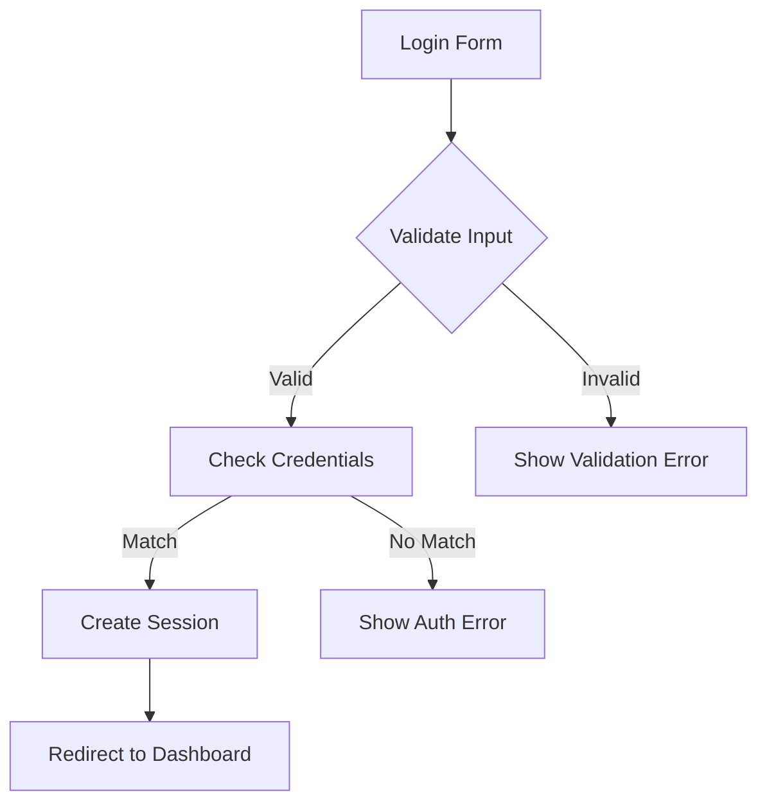

# Detailed Spec Creator

Generate a comprehensive feature specification with diagrams, flow charts, and thorough documentation.

> **Philosophy:** Clarity over brevity. Leave no ambiguity.

---

## The Job

1. Receive feature description from user
2. Ask 2-3 essential clarifying questions (with lettered options)
3. Generate comprehensive spec following Spec Format v1
4. Save to `specs/[feature-name].md`

---

## Spec Format

**Required YAML Frontmatter:**

```yaml
---
id: feature-name-v1      # Unique identifier (kebab-case + version)
title: "Feature Title"
passes: false
priority: medium         # high | medium | low
risk: standard           # spike | integration | standard | polish
created: YYYY-MM-DD
depends_on: []           # Array of spec IDs this depends on (optional)
---
```

**Required Sections (Detailed):**

1. **One-liner** - What this does in 10 words
2. **Context Table** - User, Trigger, Success in table format
3. **Scope** - In/Out with bullet points
4. **Dependencies** - Checklist of prerequisites
5. **Flow** - Mermaid flowchart AND ASCII diagram
6. **Examples** - Multiple tables (happy path, edge cases, errors)
7. **Scenarios** - Multiple Gherkin scenarios with Scenario Outlines
8. **Files** - Directory structure showing affected files
9. **Done When** - Comprehensive checklist (checkboxes)

---

## Clarifying Questions Format

Ask with lettered options for quick responses:

```
1. What is the primary success scenario?
   A. [Option based on context]
   B. [Alternative]
   C. [Another alternative]
   D. Other: [specify]

2. What are the key error conditions?
   A. [Common error]
   B. [Edge case]
   C. Both A and B
   D. Other: [specify]
```

User can respond with "1A, 2C" for speed.

---

## Story Sizing

Each spec must be completable in ONE Baldrick iteration.

If the feature is too large, suggest splitting into multiple specs with `depends_on` references.

---

## Example Output

```markdown
---
id: user-login-v1
title: "User Login with Email"
passes: false
priority: high
risk: integration
created: 2026-01-11
depends_on:
  - user-schema-v1
  - session-middleware-v1
---

# User Login with Email

> **One-liner:** Authenticate users with email and password credentials.

## Context

| | |
|---|---|
| **User** | Registered user |
| **Trigger** | Submitting login form |
| **Success** | User redirected to dashboard with session |

## Scope

**In Scope:**

- Email/password form
- Session creation
- Error messages for invalid credentials

**Out of Scope:**

- Password reset
- Social login (OAuth)
- Remember me checkbox

## Dependencies

- [ ] User table exists with email/password_hash columns
- [ ] Session middleware configured

## Flow



```
┌─────────────┐     ┌──────────────┐     ┌─────────────┐
│ Login Form  │────▶│   Validate   │────▶│Check Creds  │
└─────────────┘     └──────────────┘     └─────────────┘
                          │                     │
                          ▼ (invalid)           ▼ (no match)
                    ┌──────────┐          ┌──────────┐
                    │Val. Error│          │Auth Error│
                    └──────────┘          └──────────┘
```

## Examples

### Happy Path

| Input | Action | Output |
|-------|--------|--------|
| `alice@example.com`, `secret123` | Login | Session created, redirect to `/dashboard` |

### Edge Cases

| Input | Condition | Expected |
|-------|-----------|----------|
| `""` | Empty email | `400: {error: "Email required"}` |
| `not-an-email` | Invalid format | `400: {error: "Invalid email"}` |

### Error Responses

| Trigger | Code | Response |
|---------|------|----------|
| Wrong password | 401 | `{error: "Invalid credentials"}` |
| User not found | 401 | `{error: "Invalid credentials"}` |

## Scenarios

### Successful login

Given user "alice@example.com" exists with password "secret123"
When I submit login form with email "alice@example.com" and password "secret123"
Then I am redirected to "/dashboard"
And a session cookie is set

### Scenario Outline: Invalid input

Given I am on the login page
When I submit with email "<email>" and password "<password>"
Then I see error "<error>"

Examples:
  | email              | password   | error                |
  |                    | secret123  | Email required       |
  | not-an-email       | secret123  | Invalid email format |
  | alice@example.com  |            | Password required    |

### Invalid credentials

Given user "alice@example.com" exists with password "secret123"
When I submit with email "alice@example.com" and password "wrongpass"
Then I see error "Invalid credentials"
And no session is created

## Files

```
src/
├── app/
│   └── login/
│       └── page.tsx        # Login form UI
├── actions/
│   └── auth.ts             # Login server action
└── tests/
    └── auth.test.ts        # Auth tests
```

## Done When

- [ ] Login form renders with email/password fields
- [ ] Valid credentials create session and redirect
- [ ] Invalid email format shows validation error
- [ ] Wrong password shows "Invalid credentials"
- [ ] Non-existent user shows "Invalid credentials" (no user enumeration)
- [ ] Build passes
- [ ] Tests pass with new auth tests
```

---

## Output

- **Format:** Markdown (`.md`)
- **Location:** `specs/`
- **Filename:** `[feature-name].md` (kebab-case, matches id without version)

---

## Checklist Before Saving

- [ ] Asked 2-3 clarifying questions with lettered options
- [ ] Has unique `id` field
- [ ] Has `depends_on` for any prerequisite specs
- [ ] Spec is completable in one iteration (or suggested split)
- [ ] Has ALL required sections including diagrams
- [ ] Used REAL data in examples (not `[placeholder]`)
- [ ] Includes both Mermaid and ASCII diagrams
- [ ] Has Scenario Outline for validation cases
- [ ] Saved to `specs/[feature-name].md`
