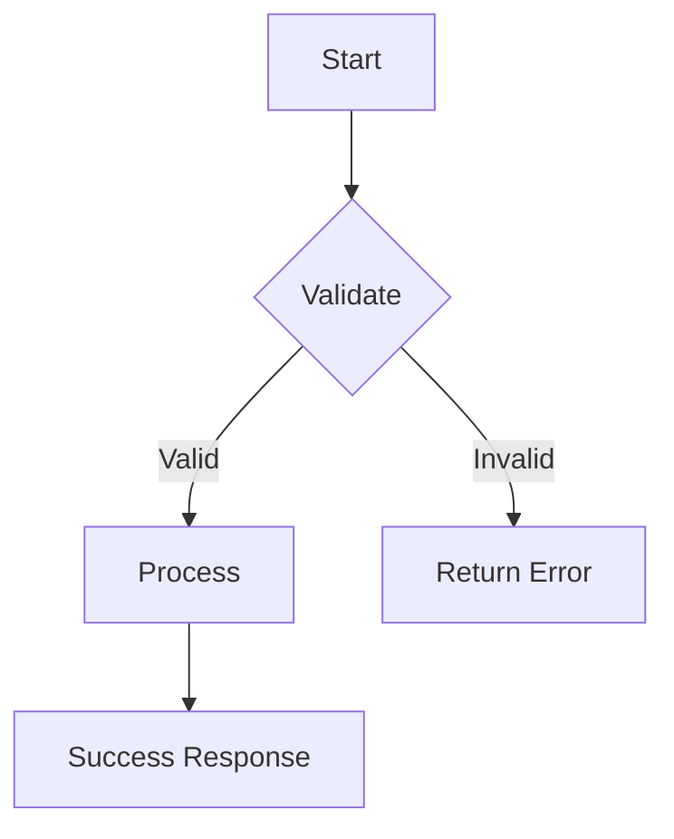

# [FEATURE_TITLE]

> **One-liner:** [What this does in 10 words or less]

## Context

| | |
|---|---|
| **User** | [Who uses this?] |
| **Trigger** | [What kicks this off?] |
| **Success** | [What does "working" look like?] |

## Scope

**In Scope:**
- [Specific deliverable 1]
- [Specific deliverable 2]

**Out of Scope:**
- [Thing we're NOT building]
- [Future consideration]

## Dependencies

- [ ] [Prerequisite that must exist first]
- [ ] [External API/service this needs]

## Flow



```
┌─────────┐     ┌──────────┐     ┌─────────┐
│  Input  │────▶│ Validate │────▶│ Process │
└─────────┘     └──────────┘     └─────────┘
                     │
                     ▼ (invalid)
               ┌─────────┐
               │  Error  │
               └─────────┘
```

## Examples

### Happy Path
| Input | Action | Output |
|-------|--------|--------|
| `alice@example.com, secret123` | Login | `{token: "abc...", user: {id: 1}}` |

### Edge Cases
| Input | Condition | Expected |
|-------|-----------|----------|
| `""` | Empty email | `400: {error: "Email required"}` |
| `not-an-email` | Invalid format | `400: {error: "Invalid email"}` |

### Error Responses
| Trigger | Code | Response |
|---------|------|----------|
| Invalid credentials | 401 | `{error: "Invalid credentials"}` |
| Server error | 500 | `{error: "Internal server error"}` |

## Scenarios

### Scenario: [Happy path name]
```gherkin
Given [concrete precondition with real values]
When [specific action with real data]
Then [explicit expected result]
And [additional assertion]
```

### Scenario Outline: [Validation cases]
```gherkin
Given [precondition]
When [action with <input>]
Then I receive <status> with <response>

Examples:
  | input              | status | response                |
  | valid_data         | 200    | success object          |
  | missing_field      | 400    | "Field required"        |
  | invalid_format     | 400    | "Invalid format"        |
```

### Scenario: [Error case name]
```gherkin
Given [precondition]
When [action that triggers error]
Then [specific error response]
And [side effects - e.g., "no data is modified"]
```

## Files

```
src/
├── [path]/
│   └── [file.ts]        # [What this file does]
└── tests/
    └── [file.test.ts]   # Tests for this feature
```

## Done When

- [ ] [Specific, testable criterion 1]
- [ ] [Specific, testable criterion 2]
- [ ] [Error case is handled correctly]
- [ ] Build passes
- [ ] Tests pass with new tests
- [ ] Manual: [Specific verification step]
